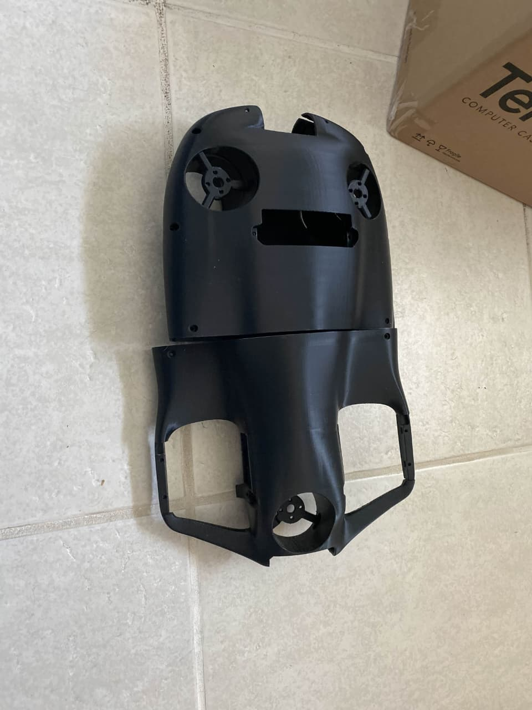

# 🤖 VARUNA

**An autonomous underwater ROV — Raspberry Pi + Pixhawk + BlueOS with real-time video over Ethernet.**

VARUNA is a custom-designed modular underwater drone (ROV) built for deep-sea exploration, inspection, and research. It integrates mechanical design, embedded systems, and AI-driven software into a robust, adaptable underwater platform — a floating research lab capable of real-time sensing, navigation, and intelligent decision-making.

## 🎯 Key Features

- ⚙️ **5-Thruster Configuration** — full 6-DOF motion
- 🧠 **Onboard Intelligence** — computer vision + SLAM ready
- 🔋 **High Endurance Power** — multi-LiPo setup
- 🌊 **Pressure-Resistant Hull** — up to ~85 m depth
- ⚖️ **Neutral Buoyancy** — passive stability
- 🔌 **Hybrid Control** — Raspberry Pi + Pixhawk + MCU
- 📡 **Flexible Communication** — tethered + acoustic-ready
- 🧩 **Modular Architecture** — easy upgrades

## 🛠️ Technical Specifications

| Parameter | Value |
|-----------|-------|
| Max Depth | 85 meters |
| Speed | 2.5 m/s |
| Endurance | ~2 hours |
| Weight | 4–7 kg |
| Power | 4S LiPo (5200 mAh × multiple) |
| Thrusters | 5 (BLDC-based) |
| Compute | Raspberry Pi 5 + Pixhawk + Teensy |
| Sensors | IMU, Depth, Temperature, Camera |

## 🔩 Propulsion System

5 thrusters:
- **2 horizontal** → surge & yaw
- **3 vertical** → heave, pitch & roll

## 🧱 Mechanical Design

- 🧩 3D-printed polymer hull
- 🔍 Transparent acrylic electronics bay
- 🔒 Multi O-ring sealing system
- 🧲 Adjustable ballast for buoyancy

> **Stability principle:** Center of Buoyancy (CB) > Center of Gravity (CG) → passive stability.

## 🔌 Electronics & Power

- ⚡ Separate power rails (logic & motors)
- 🔄 MOSFET + relay-based control
- 🔇 EMI mitigation (shielding & twisted pairs)

**Core components:** Raspberry Pi 5 · Pixhawk flight controller · ESCs (4-in-1 + individual) · MS5837 depth sensor · IMU · Sony IMX-series camera

## 📡 Communication

**Internal:** UART · I2C · SPI
**External:** 🔗 tethered Ethernet (testing & control) · 🌊 acoustic (future) · 💡 optical (short-range high-speed)

## 🤖 Software Stack

- 🐧 Linux-based system (Raspberry Pi)
- 🐍 Python for high-level control
- 🤖 SLAM & computer vision ready
- 🎯 Sensor fusion (IMU + depth)
- ⚙️ Low-level firmware on MCU

## 🧪 Applications

- 🌊 Marine research & surveys
- 🏗️ Underwater infrastructure inspection
- 🏺 Archaeological exploration
- 🌱 Environmental monitoring
- 🔍 Search & rescue operations

## 🔮 Future Work

- Autonomous navigation (full AUV mode)
- Advanced SLAM implementation
- Acoustic communication integration
- AI-based object detection & classification
- Swarm robotics (multi-drone coordination)

## 📄 License

[MIT](LICENSE) © Priyanshu Rout